---
title: "INSTAL·LACIÓ DE PROGRAMARI EN LLIUREX"
author: [Alfredo Rafael Vicente Boix]
date: "2023-06-22"
subject: "Proxmox"
keywords: [Xarxa, Instal·lació]
subtitle: "Programari recomanat per a utilizar en Arduino en LliureX"
lang: "ca"
page-background: "background10.pdf"
titlepage: true,
titlepage-rule-color: "360049"
titlepage-background: "background10.pdf"
colorlinks: true
header-includes:
- |
  ```{=latex}
  \usepackage{awesomebox}
  ```
pandoc-latex-environment:
  noteblock: [note]
  tipblock: [tip]
  warningblock: [warning]
  cautionblock: [caution]
  importantblock: [important]
...

<!-- \awesomebox[violet]{2pt}{\faRocket}{violet}{Lorem ipsum…} -->

<!--  -->

# Introducció

En aquesta unitat veurem com instal·lar el diferent programari que anem a utilitzat en LliureX. Com veurem la instal·lació és molt senzilla. Cadascun d'aquest programari té els seus avantatges i els seus inconvenients.

## El zero-center

LliureX disposa d'un assistent que ens permetrà instal·lar tot el programari necessari d'una manera molt senzilla. Es tracta del zero-center. Per a iniciar el zero-center ho fem des del menú inici i escrivim en la barra de búsqueda *zero-center*.

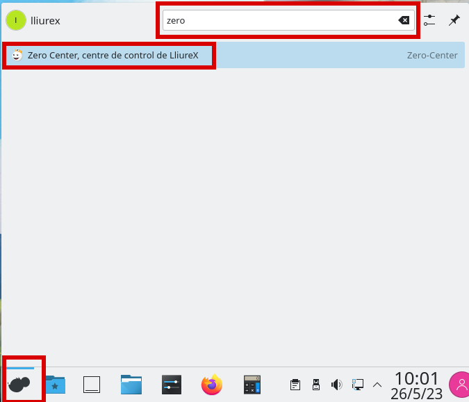{ width=50% }

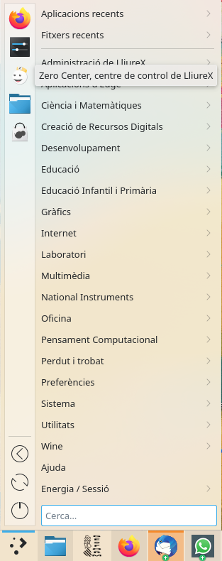{ width=50% }

:::warning
Cal tenir l'ordinador actualitzat per a fer l'instal·lació. És possible que al teu centre no tingues permisos per a fer la instal·lació, per tant cal que li demanes al l'administrador que t'ho faja.
:::

Una vegada entrem podem veure que hi ha una barra de cerca.

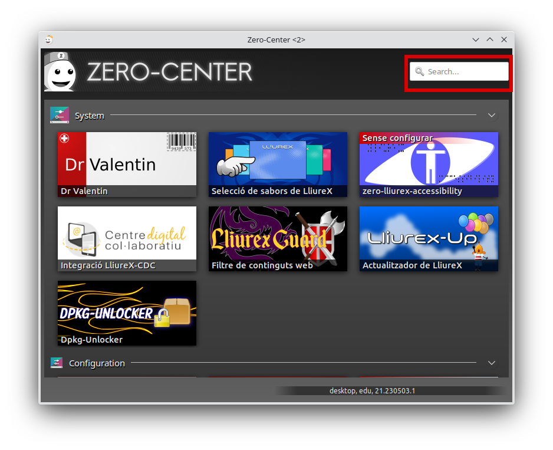{ width=50% }

# S4A. Scratch for Arduino

Scratch for Arduino (S4A) és un programari desenvolupat a Catalunya que ens permet interactuar elements que tenim en pantalla amb elements reals connectats a una placa Arduino UNO. Açò facilita la introducció a la programació.

És per això que el principal inconvenient que presenta aquest programa és que no es pot treballar amb la placa d'Arduino de manera autònoma, sempre caldrà que estiga connectat.

Per a fer la instal·lació, només hem de buscar "s4a" al buscador del zero-center i fer clic:

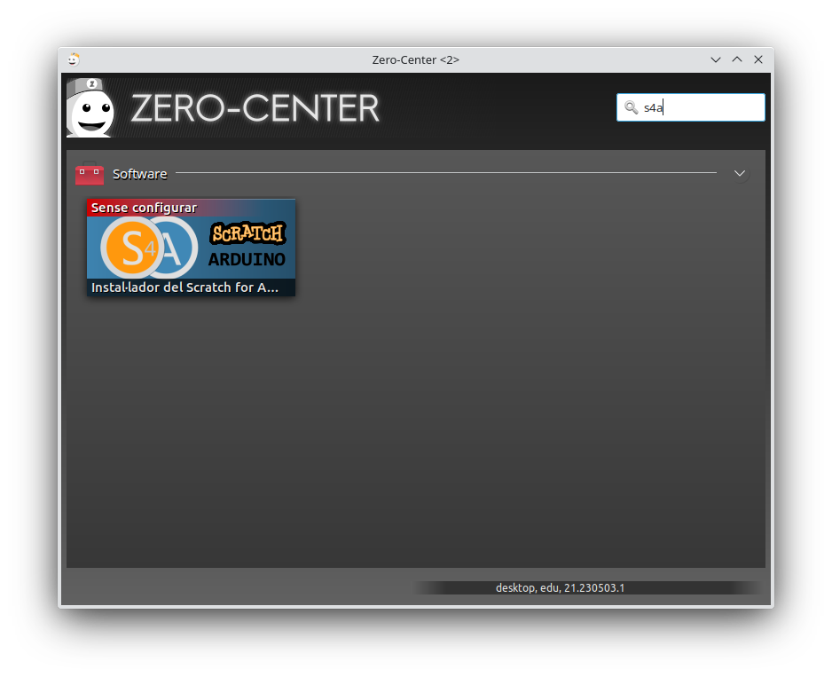{ width=50% }

Una vegada fem clic, veurem la següent pantalla on farem clic en instal·la:

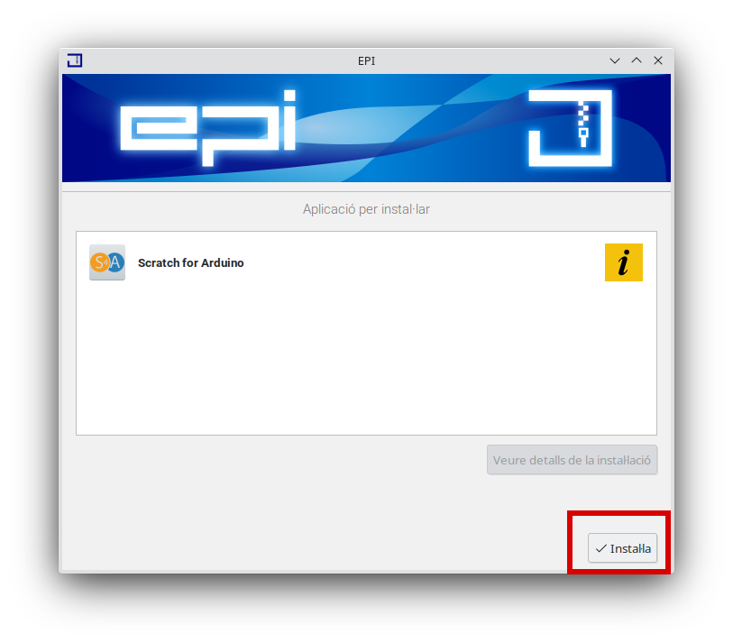{ width=50% }

Llavors començarà el procés d'instal·lació.

# Block@rduino i Arduino IDE

Per tal de facilitar la instal·lació i fer-ho de manera més ràpida, instal·larem directament el Blocky@rduino i aquest arrastrarà ja el Arduino IDE.

Arduino IDE és l'entorn que s'utilitza per a programar en Arduino i s'utilitza el llenguatge C++, Blocky@rduino és un plugin per a Arduino IDE que ens permetrà fer ús de la programació en blocs i després "traduirà" el que hem fet a codi C++.

El principal avantatge de treballar així és que es pot treballar de manera autònoma amb Arduino, a més hi han blocs ja creats que simplifiquen enormement la programació de diferents dispositius com veurem en l'exemple que vos plantejarem en la unitat.

Per a instal·lar-lo busquen "Arduino" al zero-center i veurem que s4a ja ens apareix configurat 

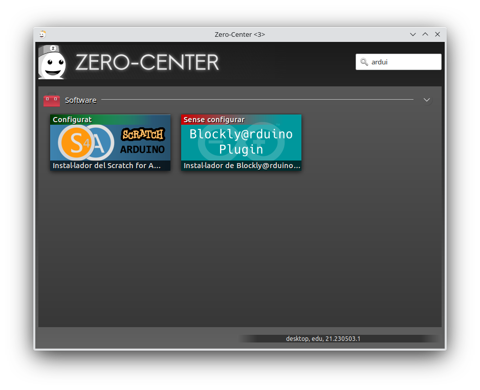{ width=50% }

El procés és el mateix d'abans, fem clic en Instal·la per a començar la instal·lació.

# Provem la nostra placa d'Arduino

En aquest moment provarem la nostra placa d'Arduino, és important que vos quedeu en aquest procés ja que cada vegada que inicieu Arduino IDE, serà necessari que configureu el vostre port.

En primer lloc iniciem Arduino IDE:

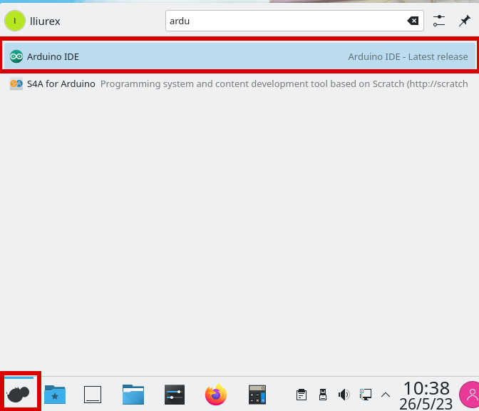{ width=50% }

Ens apareixerà la següent pantalla:

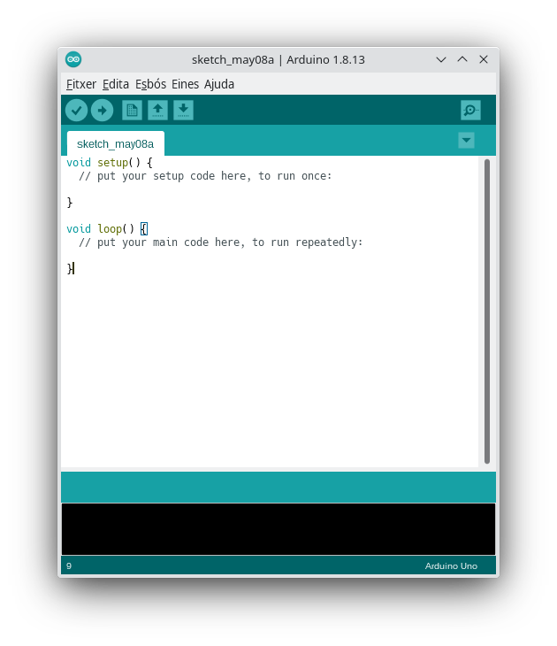{ width=50% }

Ara carregarem un programa d'exemple per veure que tot funciona correctament:

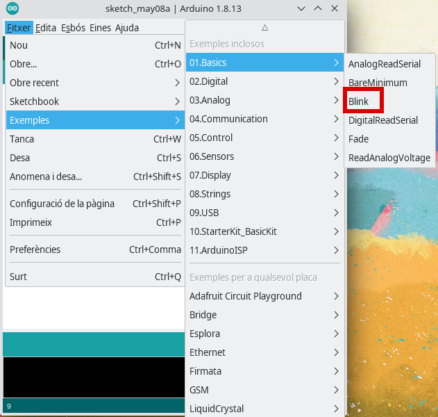{ width=50% }

Després caldrà configurar el port:

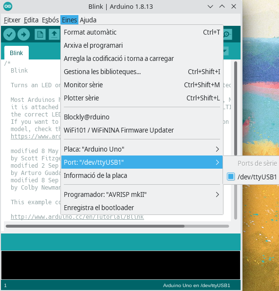{ width=50% }

Finalment farem clic sobre el botó de pujar el programa:

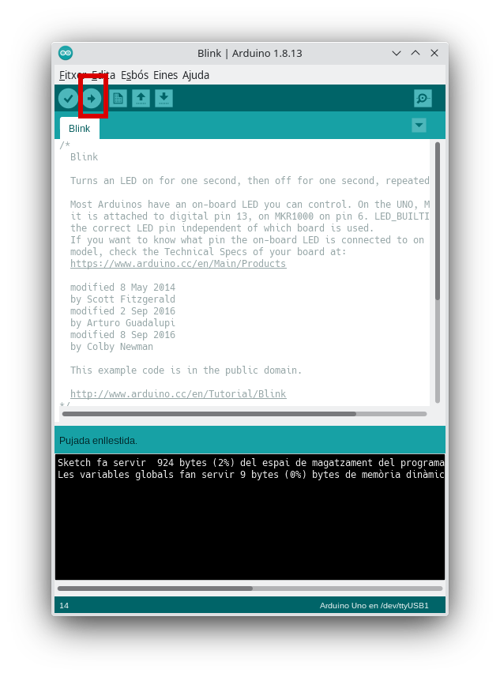{ width=50% }

Ara podrem veure com un LED de la nostra placa comença a parpellejar.

:::info
Aquest programa és molt utilitzat per a fer proves amb Arduino. En la propera unitat també vos deixarem com a exemple aquest procés per a assegurar-se que sempre fem una prova abans de començar a treballar. Cal vore que tot funciona correctament.
:::

Per a iniciar Blocky@rduino cal obrir el plugin dins del programa Arduino IDE.

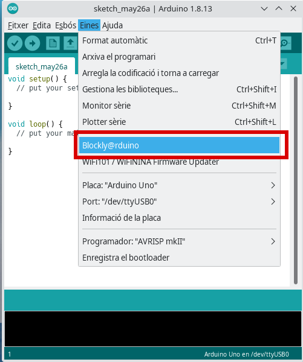{ width=50% }
