---
title: "PROGRAMARI EN LLIUREX. S4A"
author: [Alfredo Rafael Vicente Boix]
date: "2023-06-22"
subject: "Proxmox"
keywords: [Xarxa, Instal·lació]
subtitle: "Programari recomanat per a utilizar en Arduino en LliureX"
lang: "ca"
page-background: "background10.pdf"
titlepage: true,
titlepage-rule-color: "360049"
titlepage-background: "background10.pdf"
colorlinks: true
header-includes:
- |
  ```{=latex}
  \usepackage{awesomebox}
  ```
pandoc-latex-environment:
  noteblock: [note]
  tipblock: [tip]
  warningblock: [warning]
  cautionblock: [caution]
  importantblock: [important]
...

<!-- \awesomebox[violet]{2pt}{\faRocket}{violet}{Lorem ipsum…} -->

<!--  -->

# Introducció

Arduino disposa de multitud de programari per a poder desenvolupar els diferents projectes. Òbviament el més habitual és el Arduino IDE que és l'entorn propi d'Arduino per a programar els diferents dispositius. Per a poder desenvolupar projectes en Arduino IDE és recomanabe conèixer un poc del llenguatge de programació C o C++. En les diferents alternatives que anem a plantejar en aquesta unitat veurem que al menys hem d'entendre un poc el funcionament d'aquest entorn. En aquesta unitat en centrarem en una de les ferramentes més importants per a introduir-se en Arduino:

* Breu Introducció a l'Arduino IDE.
* Scratch for Arduino

Cadascú d'aquest entorns té els seus avantatges i inconvenients. Èn aquest cas també veurem una xicoteta introducció a blocky.

:::note
Cal dir que totes aquestes opcions són multiplatafroma, per tant estan disponibles tan en LliureX con en Windows
:::

# Arduino IDE

Arduino IDE és el sistema d'Arduino per a programar els dispositius. Per a programar-lo és necessari conèixer el llenguatge de programació C

La primera vegada que obrim el programa veurem la següent imatge:

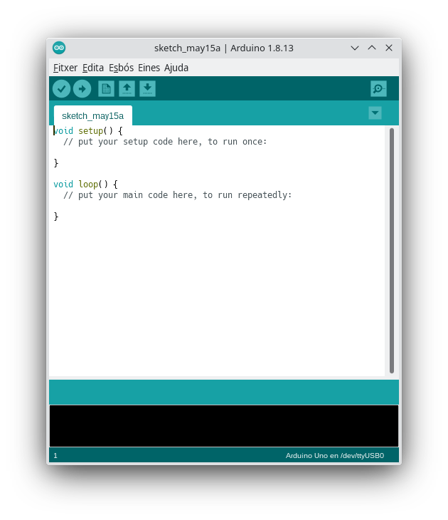{ width=50% }

Podem veure que ha ens apareix algo de codi, però nosaltres no anem a fer cas. El que sí que és encessari és conèixer com es pot programar el dispositiu, ja que quan el programem sempre ho farem a través d'aquest programa. Els passos que caldria seguir serien els següents:

1. Cal comprovar que el dispositiu està connectat al port USB. Arduino IDE porta alguns programes d'exemples, des de molt senzills a més complicats. Aquest es troben a Fitxer>Exemples. En aquest cas i per a provar el funcionament de la placa provarem el més senzill de tots "Blink".

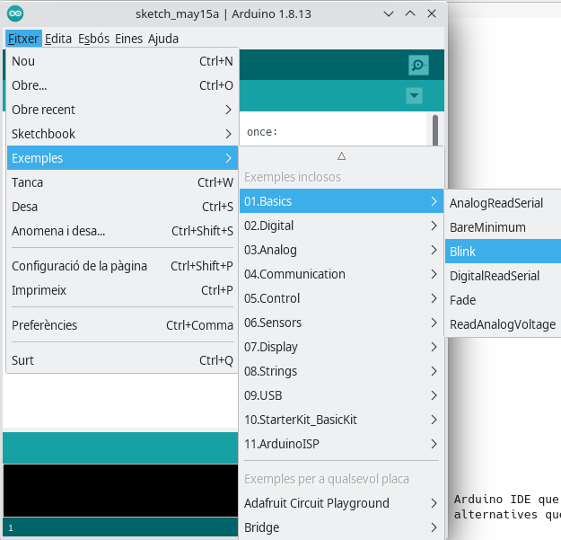{ width=50% }

2. Vorem se'ns obre una finestra nova amb el programa. No ens pararem a analitzar el programa però pots veure que és molt senzill d'entendre si saps un poc de programació. A més aquest està ple de comentaris per a facilitar-nos la seua comprensió.

3. És important assegurar-se que el programa té el dispositiu USB correctament configurat, podem comprovar-ho anant a Eines>Port. D'aquesta manera ja podrem enviar el nostre programa a la nostra placa Arduino.

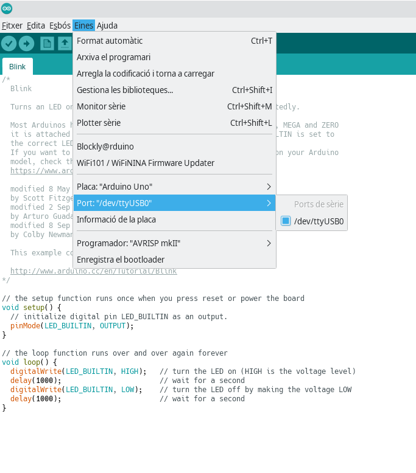{ width=50% }

4. Per a enviar el programa podem fer-ho des de la següent icona:

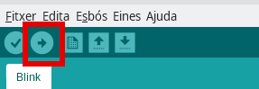{ width=50% }

5. Veurem que una llum LED del nostre Arduino comença a parpellejar. Aquest LED està connectat al port 13 del nostre Arduino, per tant si connectarem un LED a en aquesr pin també s'encendria i s'apagaria.

6. Cal prestar especial atenció a la secció de debug que ens apareix baix de la finestra d'Arduino ja que ens dona una idea del problema que pot haver en el nostra programa. En aquest cas hem canviar una paraula del programa i ens diu on està l'errada per a que ho solucionem:

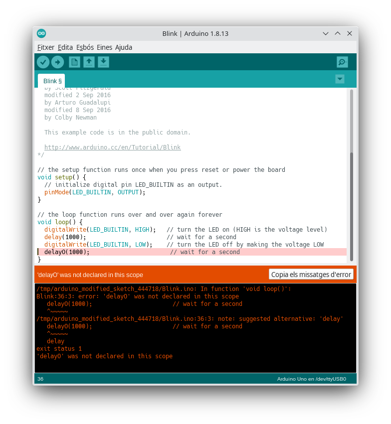{ width=50% }

:::tip
Òbviament amb Arduino IDE es pot fer gairebé de tot, és un programari molt potent i que dona moltíssimes opcions per a programar i controlar el nostre Arduino.
:::

Finalment cal assenyalar que si volem carregar un programa a la nostra placa que ens ha deixa't algun company ho podem fer de la següent manera. Aquestos normalment porten l'extensió .ino i polsarem el següent botó:

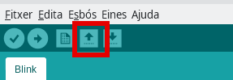{ width=50% }

# S4A - Scratch for Arduino

S4A és un programari desenvolupat a Catalunya que ens permet connectar la placa en temps real al nostre Arduino. Per a utilizar-la abans que res hem d'instal·lar un firmware[^1] especial per a la placa, aquest firmware el podeu trobar al curs d'Aules o el podeu descarregar directament des [d'ací](http://s4a.cat/downloads/S4AFirmware16.ino).

I ara posarem en pràctica el que hem après en la secció anterior i carregarem aquest programa en la nostra placa. Recordem que hem de:

1. Obrir el programa
2. Pujar-lo a la nostra placa

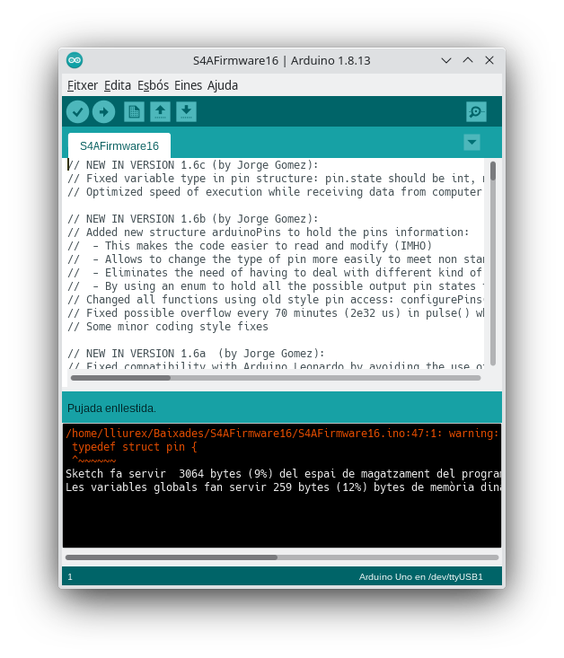{ width=50% }

:::warning
Cada vegada que pujeu un programa assegureu-vos que el vostre USB no està ocupat. Una errada molt comuna és tenir l'S4A i el Arduino IDE oberts al mateix temps i això produix problemes amb l'enviament de programari a la placa.
:::

Al punt posterior farem una xicoteta introducció a Blockly aprofintant el programari S4A. Un desl principals avantatges que presenta S4A és que no només anem a programa una placa sinó que podem programar botons a l'ordinador per a que facen tasques determinades.

Això, en canvi, ens proporciona certs desavantatges com per exemple que els components s'han de connectar d'una manera determinada. S4A habilita 6 entrades analògiques (pins analògics), 2 entrades digitals (pins digitals 2 i 3), 3 sortides analògiques (pins digitals 5, 6 i 9), 3 sortides digitals (pins 10, 11 i 13) i 4 sortides especials per a connectar servomotors de rotació contínua Parallax (pins digitals 4, 7, 8 i 12). I així queda determinat, no podem utilitzar un pin especial per a fer una altra sortida digital a no ser que retoquem el firmware de S4A.

[^1]: Quan parlem de firmware ens referim a un programa per a carregar a la nostra placa. Aquest programa té unes funcions específiques.

## Introducció a Blockly amb S4A

És possible que alguns de vosaltres hageu escoltat el terme *Scratch* com a llenguatge de programació. Cal dir que la terminologia correcta és:

* El llenguatge de programació d'anomena **Blockly** i va ser dissenyat per Google. Aquest llenguatge de programació es troba per tot arreu dins del món de l'aprenentatge.
* Scratch és una comunitat d'aprenentatge per aprendre a programar

:::tip
Si voleu saber més sobre el tema teniu més informació en aquesta [pàgina](https://scratch.mit.edu/developers)
:::

Blockly és un llenguatge que és utilitzat en nombroses aplicacions, des de crear videojocs, Arduino, aplicacions mòbils, etc... Totes elles orientades a l'ensenyament del pensament computacional a l'escola. Per tant, és important entendre que el llenguatge estarà adaptat per al seu propòsit final, en el nostre cas programació d'Arduino.

Abans que res el que anem a fer és engegar el programa una vegada ja hem pujat el firmware a la nostra placa:

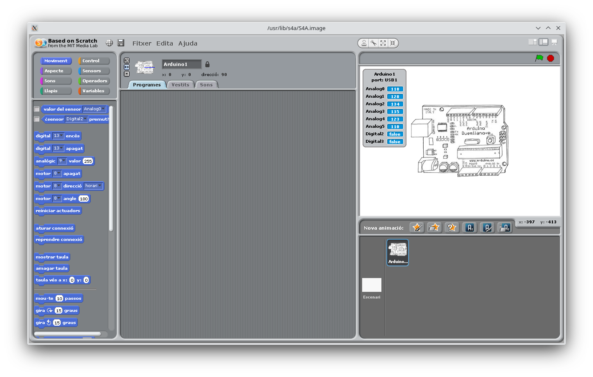

### Nocions bàsiques

Per a programar amb Blockly hem d'entendre que cada comandament és un bloc. I això què significa? Que bàsicament el que hem de fer és un trencaclosques on cada bloc hem d'anar afegint-lo als llocs on els podem posar. A S4A, si ens fixem en el seu entorn, només arranquem el programa podem veure la següent pantalla:

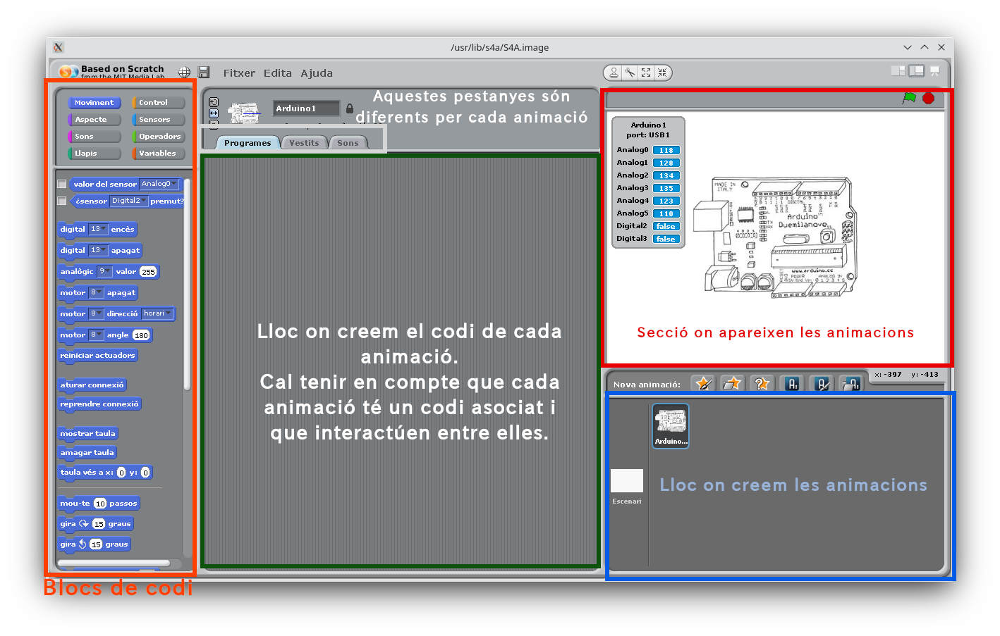

Com pots veure la pantalla està dividida per seccions, el primer que hem de fer es canviar l'idioma del programa al que nosaltres desitgem.

 
<!-- IMATGE d'idimoma -->

En el nostre cas ens centrarem en la secció de blocs i explicarem els més significatius, en els diferents programes que anem a tractar veurem que bàsicament tots els programen de la mateixa manera però, cadascú, tenen blocs propis.

:::info
Has de tenir en compte que S4A és un sistema on instal·lem un firmware especial, la placa està constantment comunicant-se amb l'ordinador, per tant es tracta d'un sistema on es treballa en l'ordinador i la placa al mateix temps. La placa no pot desconnectar-se de l'ordinador.
:::

Tractarem d'anar explicant els blocs més bàsics a través de diferents projectets amb Arduino.

:::warning
Tingueu en compte que en els projectes que tractarem ací, ens centrarem únicament en l'apartat de programació i circuiteria.
::: 

### El nostre primer programa. Hola Món!

En aquest programa no utilitzarem la placa d'Arduino tot i que la tenim connectada. Crearem una rata-penada que dirà "Hola Món" i anirà d'un lloc a altre de la zona de . En el programa ja vegem que tenim una animació integrada que és la d'Arduino. En aquest cas la podríem eliminar però anem a deixar-la per a utilitzar-la més endavant.

Creem una nova animació.

:::tip
CAda animació porta associat un programa (que podríem anomenar funció). Aquesta s'executarà sempre que es prenga la bandera verda si així ho considerem.
:::

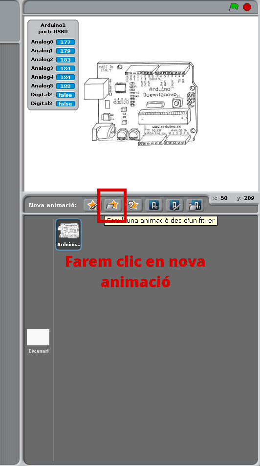{ width=50% }

Una vegada creem l'animació escollim alguna imatge, en aquest cas utilitzarem una que ha ve amb els exemples.

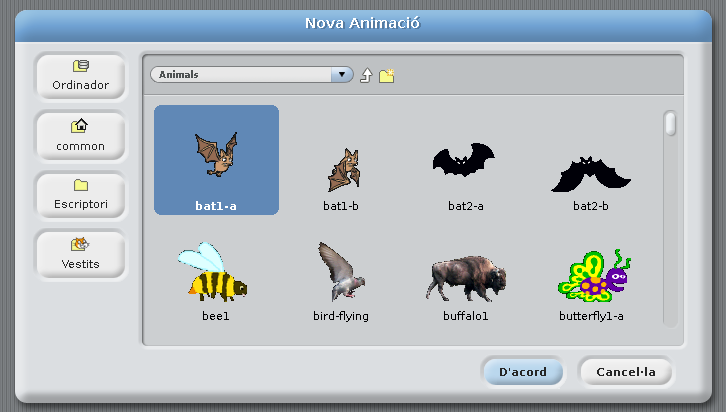{ width=50% }

I importarem una nova imatge, aquesta vegada amb les ales baixades per a poder crear una animació.

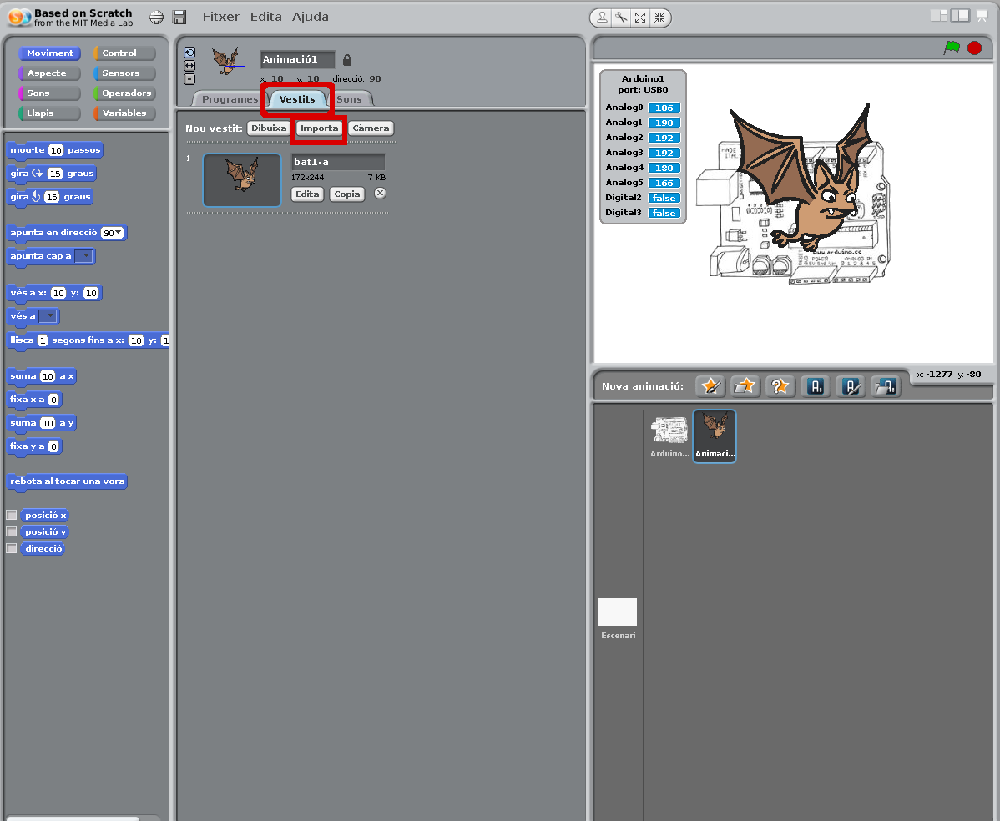 

De moment ho tindrem de la següent manera. Fixeu-vos que hi han dos botons, una bandera verda i un botó roig que ens serviran per a començar i aturar el programa.

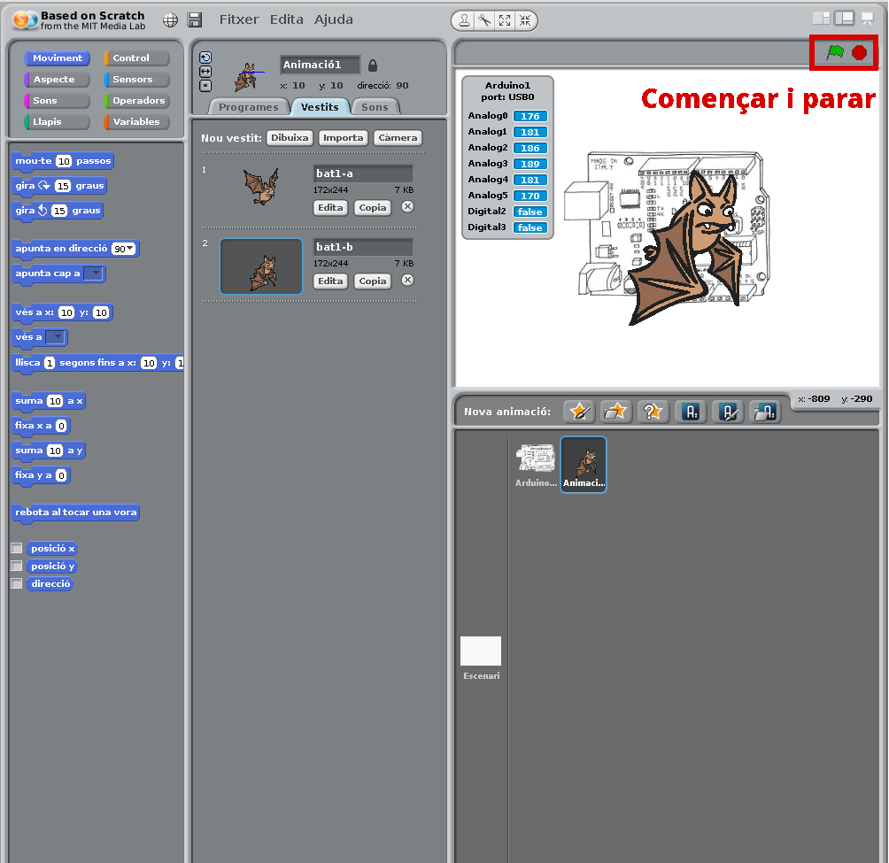 

Fixem-nos ara en dos dels blocs que més anem a utilitzar. Aquests es troben en la secció de **control**.

* Al prémer la bandera verda: quan fem clic a la bandera verda començarà el programa.
* Per sempre: Creem un bucle que farà que es repetisca constantment el que hi ha dins.
* Espera: fa una pausa dels segons que li indiquem.

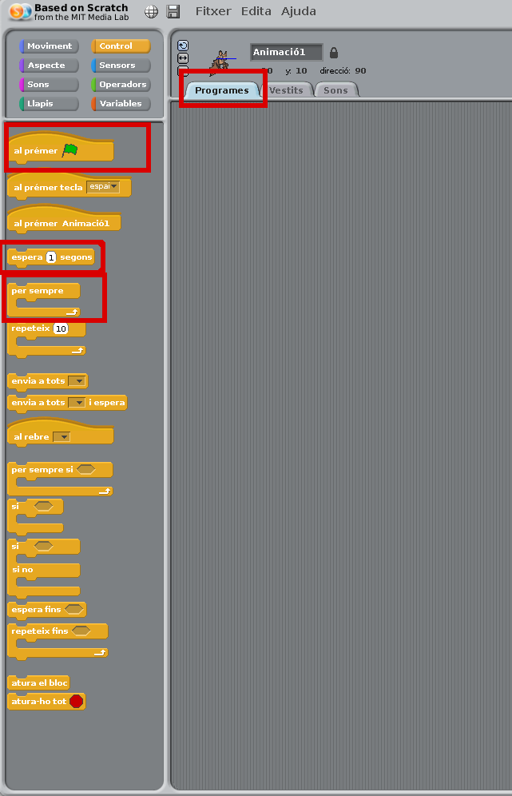 

ELs blocs cal que els agafem i els soltem sobre l'espai de treball:

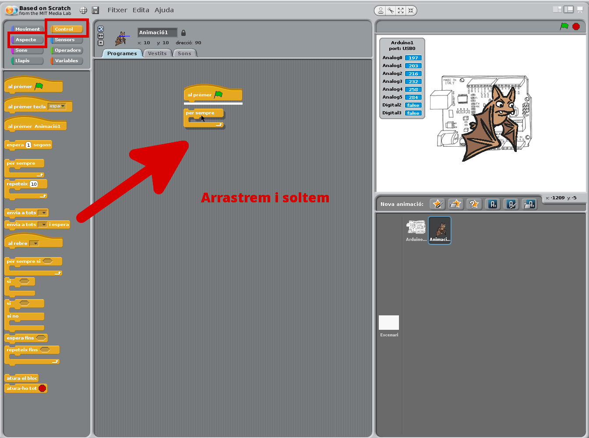

Ara anem a la secció de Aspecte per a poder canviar l'aspecte de la nostra animació cada x segons i donar l'efecte que es mou.


I finalment tenim el nostre programa on el que hem fet és:

1. Comencem amb la imatge de les ales pujades
2. Diu "Hola món!"
3. Esperem 0,5 segons
4. Canviem a la imatge de ales baixades
5. Esperem 0,5 segons

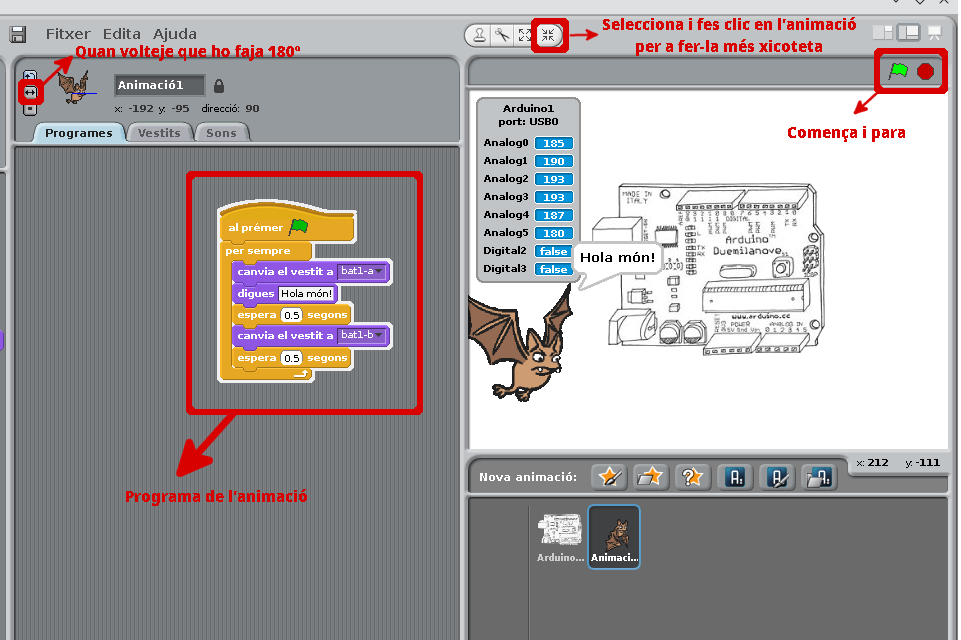

La pantalla del nostre programa quedaria de moment així:

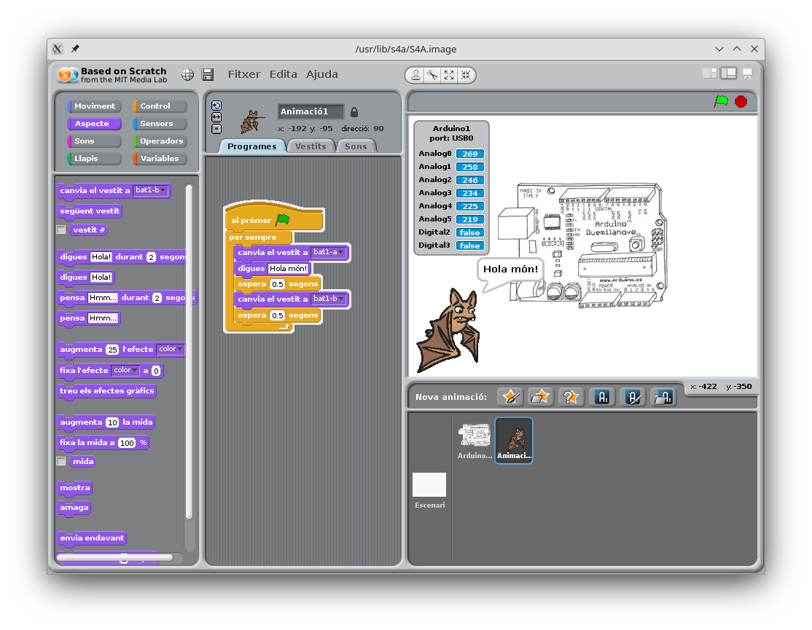

Finalment podríem afegir dos blocs que es troben en la secció de moviment:

* Mou-te X passos: que mourà l'element avant els passos que li indiquem.
* Rebota al tocar una vora: aquest element és bastant important per a que no surta la rata-penada de la pantalla.
* Hem de recordar de tindre activat l'element per a que gire només a dreta i esquerra.

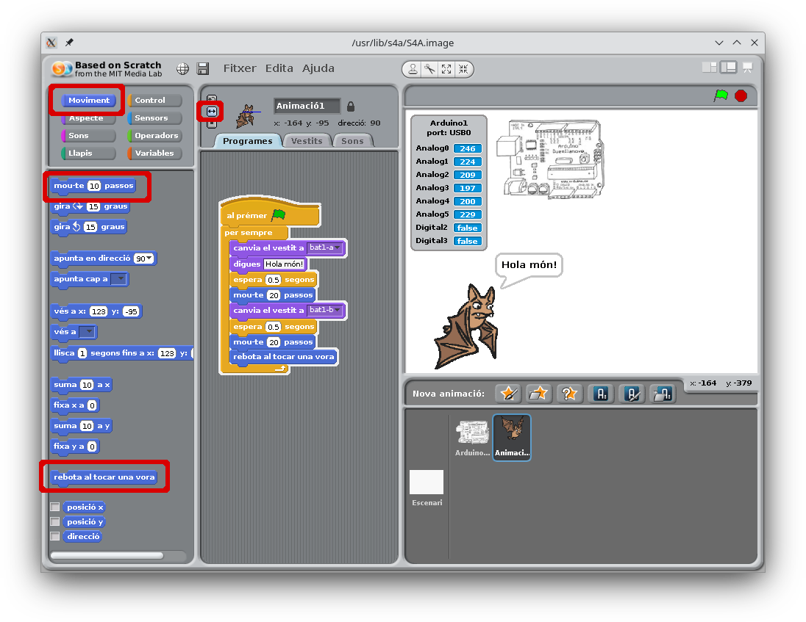

Ara ja tenim un programeta senzill que mou una rata penada.

:::caution
Si desconnecteu la placa Arduino de l'ordinador és necessari tornar a iniciar l'S4A per a que la detecte.
:::

### Afegim interactivitat

En aquest moment si que anem a connectar la nostra placa Arduino per a afegir un poc d'interactivitat al nostre projecte, anem a utilitzar sensors de presència per a controlar la nostra rata penada.

:::tip
**Però què és un sensor?** Un sensor és un element que anem a  connectar a la nostra placa Arduino per a parametritzar la realitat. Nosaltres utilitzarem sensors amb moduls que ja disposen de tota la circuiteria necessària. En estos casos només tindrem que connectar els cables a la placa Arduino, sense preocupar-nos per res més. El sensor de presència té un potenciòmetre que ens permetrà ajustar la sensibilitat.
:::

Així en el nostre projecte anem a controlar la nostra rata penada posant la mà damunt del sensor i així detectarà la nostra mà i la mourem en funció de com posem la mà. El nostre circuit quedaria de la següent manera:

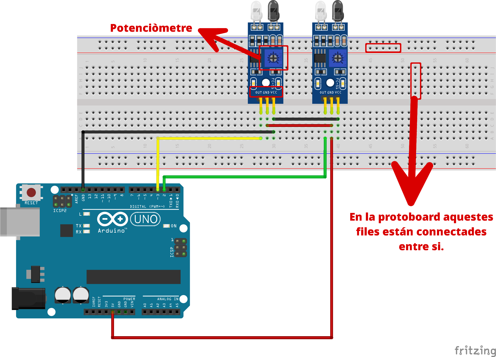

:::tip
Es recomana utilitzar cables dupont mascle-mascle, sinó es vol fer ús de la protoboard es poden utilitzar cables mascle-femella per a connectar directament el sensor a la placa Arduino
:::

Ara ja és el moment de continuar el nostre projecte, el que farem és seleccionar el dibuix Arduino i veurem que el nostre programa desapareix de l'espai de treball, en realitat no ha desaparegut sinó que està associat a l'Animació1, si tornem a fer clic en la rata penada veurem altra vegada el programa que hem creat.

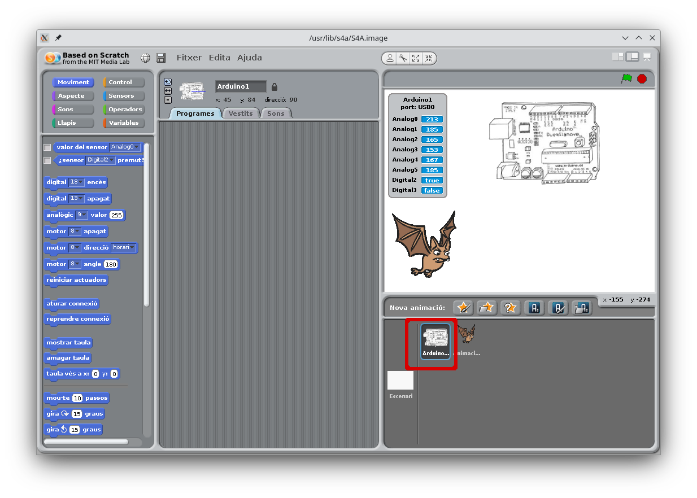

Començarem a crear el nostre programa amb un bucle tal i com hem fet abans. I anirem a variables.

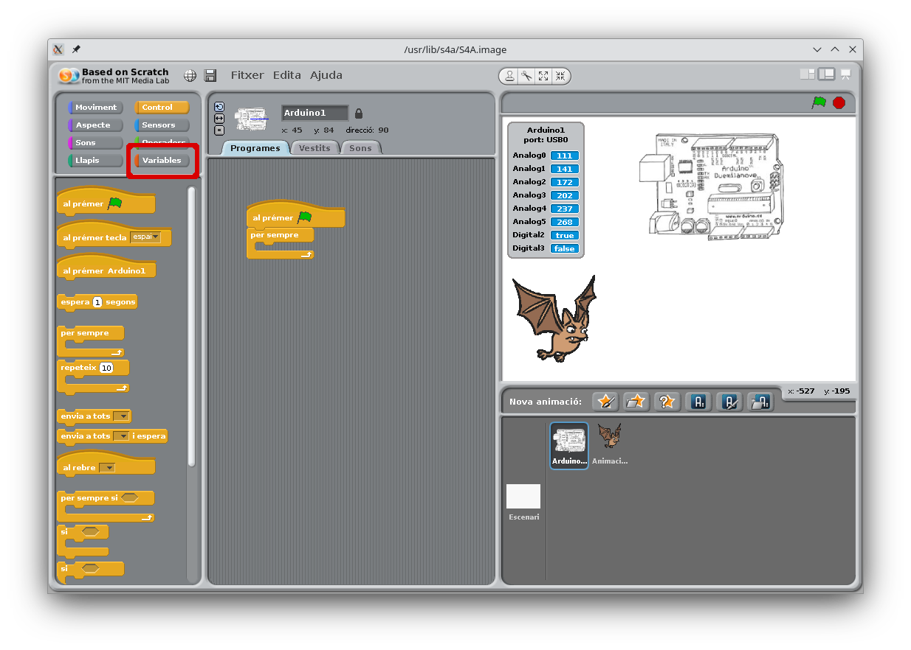

Les variables ens permetran intercanviar informació entre els diferents fils que tenim, en este cas tenim el fil de l'Animació de la rata-penada i el fil de l'Animació d'Arduino. Ara després veurem que podem tindre diversos fils dins d'una mateixa animació.

:::tip
Les animacions que estem dient per facilitar la comprensió, s'anomenen en realitat *sprites*.
:::

Així, creem les variables dreta i esquerra per a quan volem anar a dreta i esquerra.


Fixem-nos en el bloc *fixa X a Y*. Aquest bloc ens permetrà assignar valors a les variables. A més ara farem ús dels següents blocs:

* Si - si no: En aquest bloc definirem una condició que si és certa executarà el bloc que hi ha a continuació, en cas contrari executarà l'altre.
* Sensor X premut: Si s'activa aquesta entrada del circuit donarà valor vertader sinó fals.

:::warning
El firmware d'S4A habilita les pates 10,11,12,13 com a sortides digitals, els pates 3 i 4 com a entrades digitals i les pates A0,A1,A2,A3,A4 i A5 com a entrades analògiques. Hem de tenir en compte que els sensors utilitzen el que s'anomena lògica inversa, quan estan activitats donen vertader i quan no fals. Així el sensor de presència quan no hi ha cap presència dona vertader sinó fals.
:::

D'aquesta manera crearem el següent programa per a llegir constantment si es detecta presència en el sensor i se li assignarà el valor 1 en cas de que si i 0 en cas de que no.

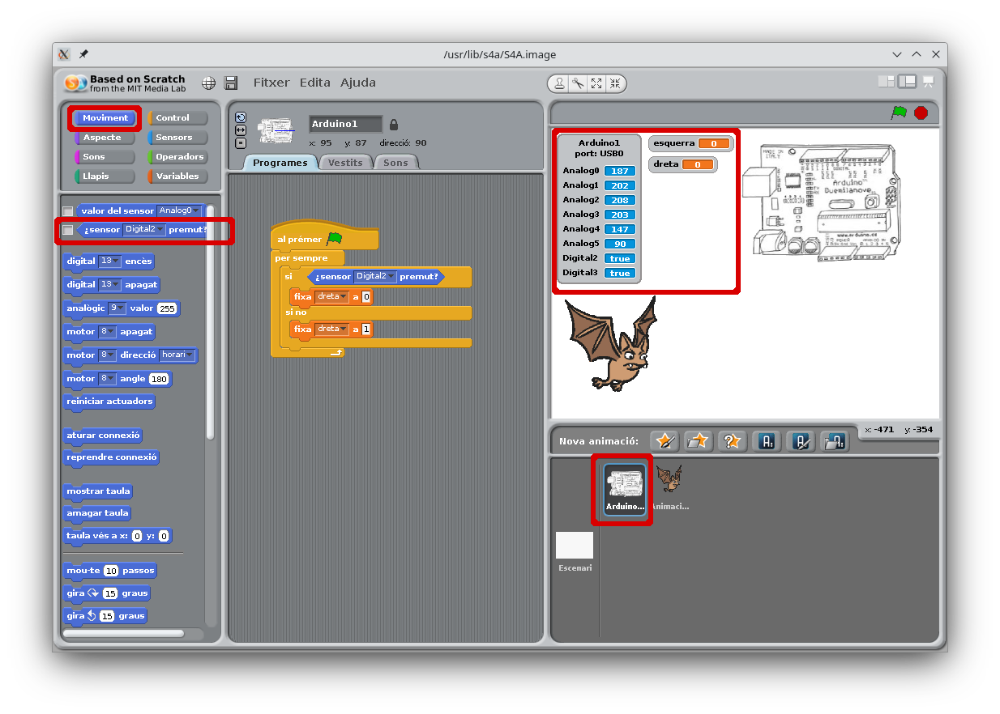

Per als dos quedaria de la següent manera:

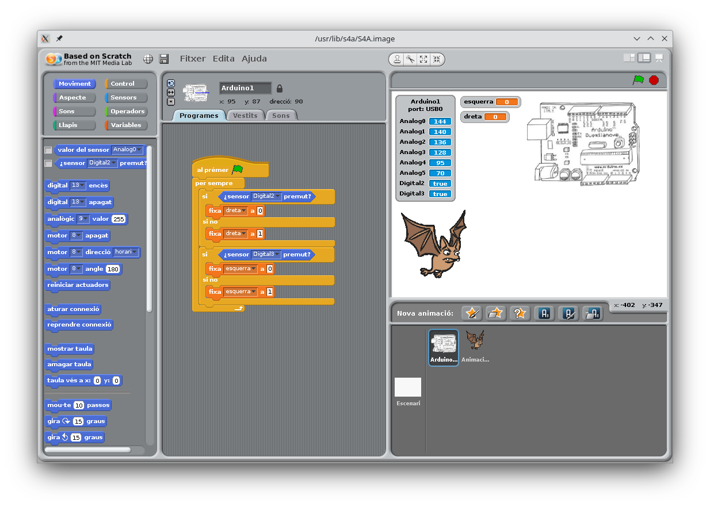

Finalment creariem en l'animació1 de la rata-penada un altre **fil** on si dreta es igual a 1, apuntarà a la dreta i en cas contrari apuntarà a l'esquerra.

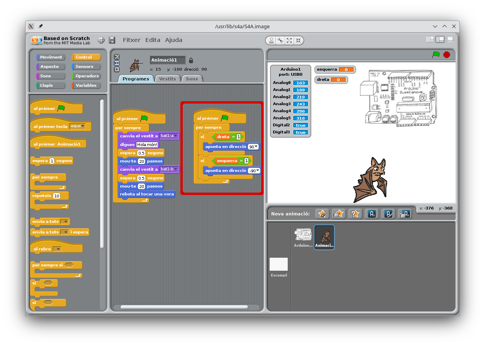

Per a fer-lo més interessant podríem fer que es mogués cap a dalt i cap avall si no té cap presència o si té presència en els dos. D'aquesta manera resultaria més divertit manejar la rata-penada.

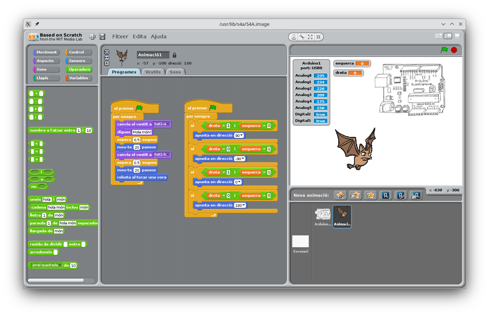

### Programa utilitzant entrades analògiques

El sensors analògics ens van a permetre parametritzar la realitat d'una manera més acurada. En aquest cas anem a utilitzar una LDR que el que fa és canviar la seua resistència en funció de la llum que té, per això cal tenir un moment per a poder mesurar en quins valors es mou. És per això que fent clic amb el botó dret del ratolí sobre la imatge d'arduino podem veure el panell de sensors. D'aquesta manera podem fer les nostres proves. En el nostre cas hem vist el valor de 300.

Hem utilitzat el següent circuit. La resistència LDR i el potenciòmetre es pot alternar de posició. Així mateix, hem posat un LED que s'encendrà quan es faja fosc. Així el nostre circuit quedaria de la següent manera:

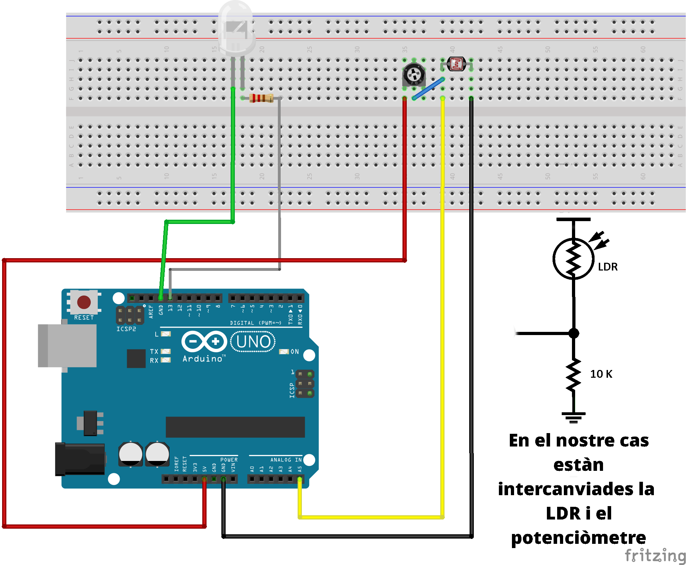

Ens crearem dos fons de pantalla i reduirem la imatge de l'Arduino:

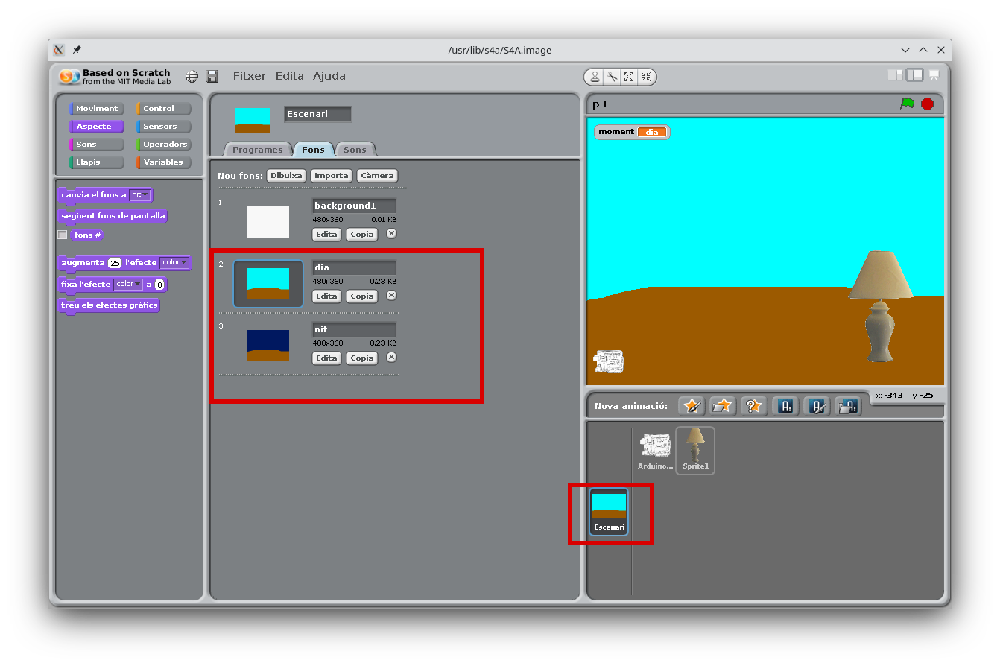

Farem el mateix amb altre element que serà la làmpara. 

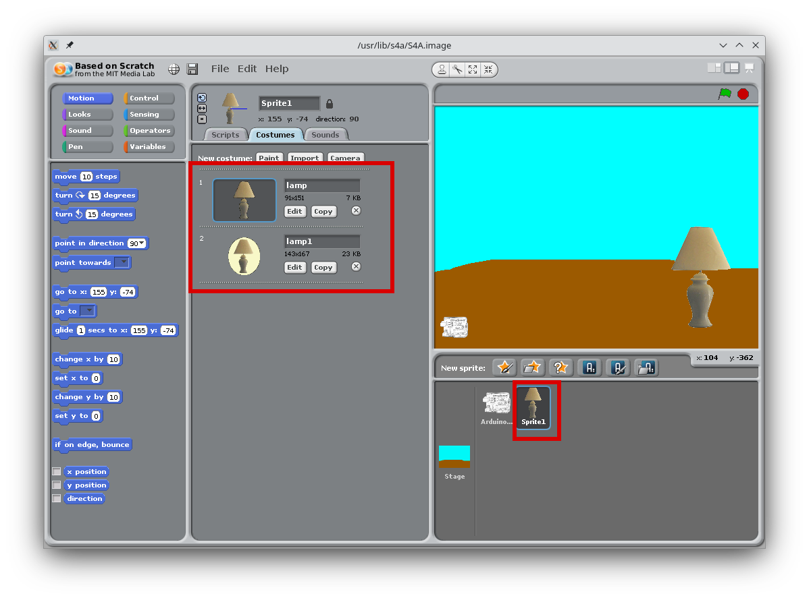

Els programes de les imatges serien molt senzills. Crearíem una variable *moment* que canviaria quan fos de dia o de nit:

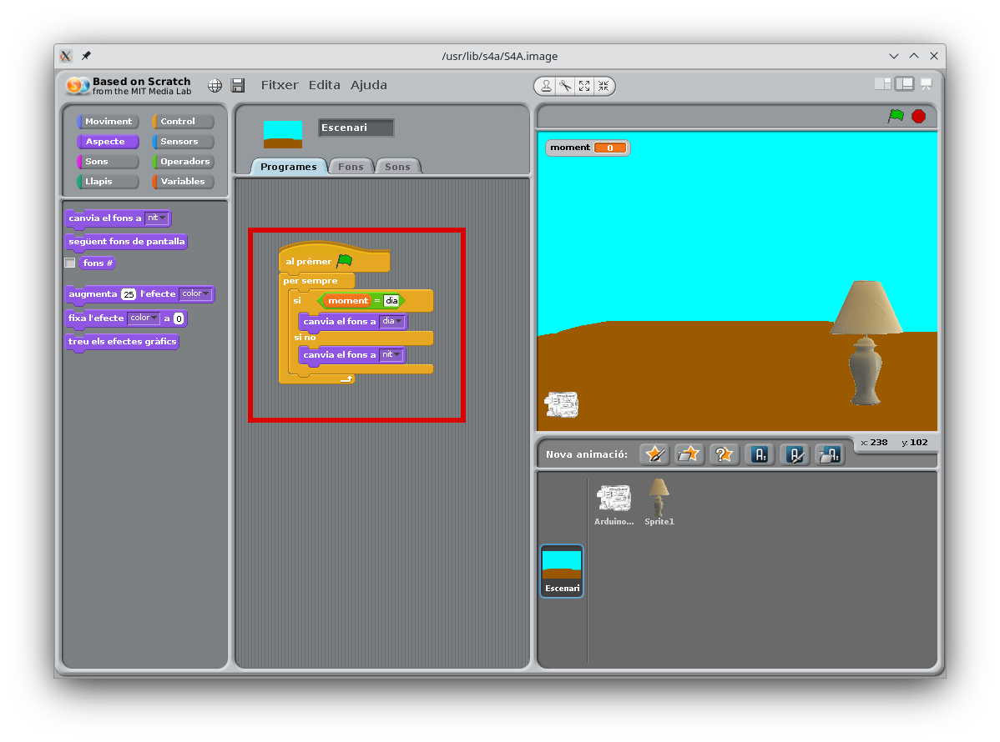

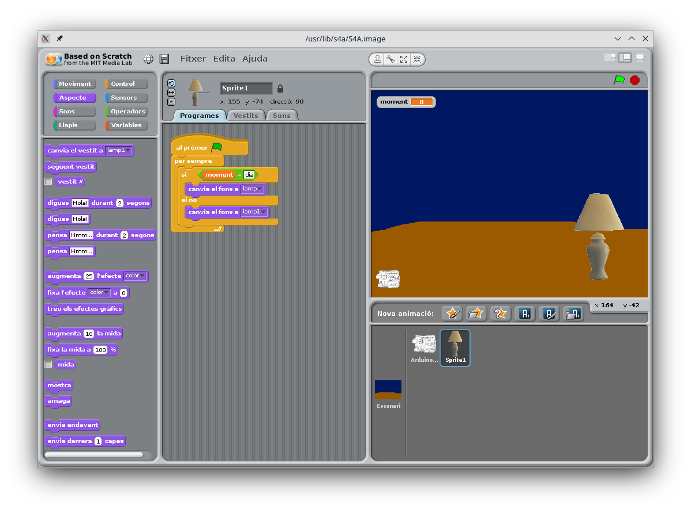

El programa d'Arduino seria qui controlaria la variables moment en funció de si el valor del sensor es 300 (en el nostre cas). Dependria de cada tipus de sensor.

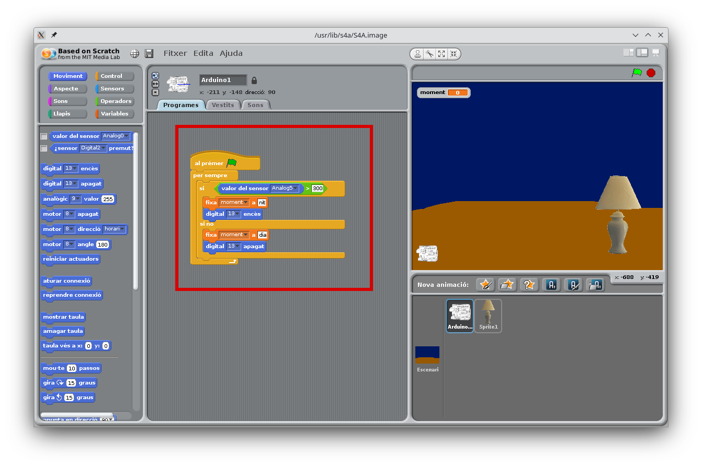

I ja tindriem el nostre sistema funcionant.

# Bibliografia i referències

(@) http://s4a.cat/index_ca.html


