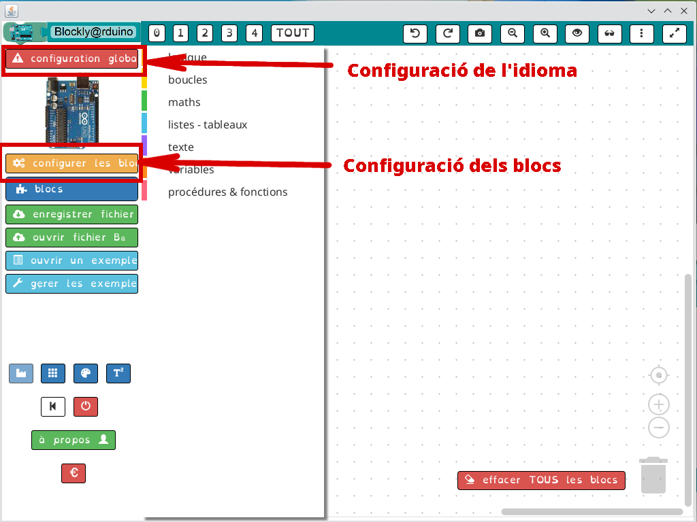
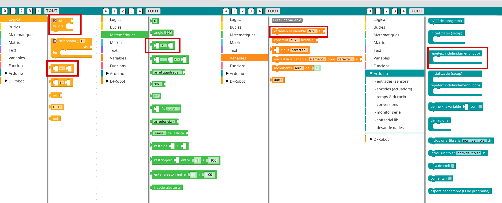
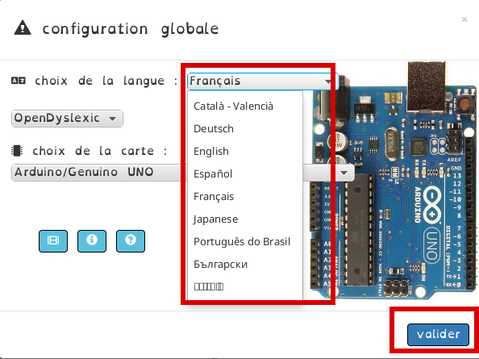
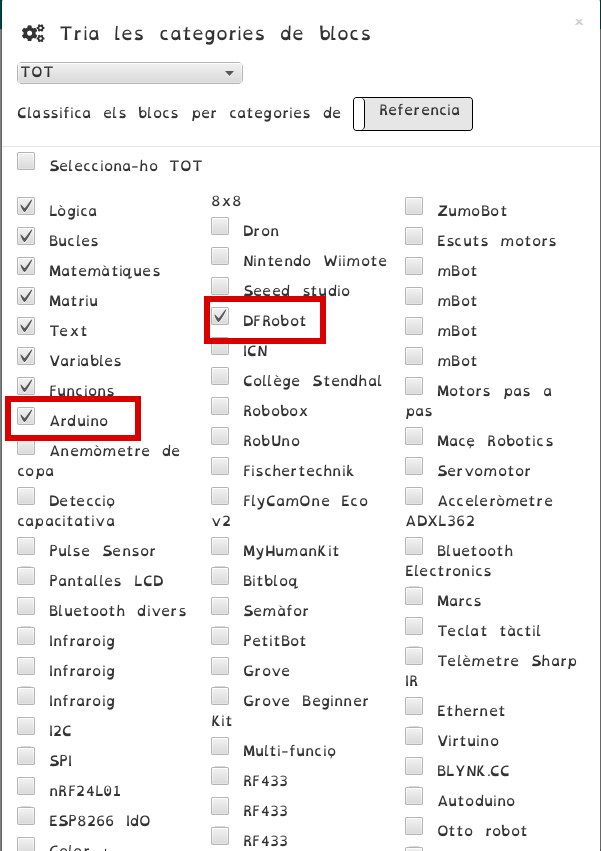
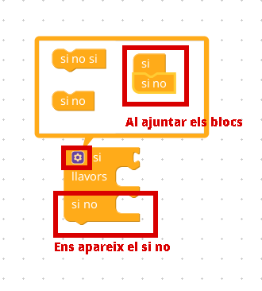
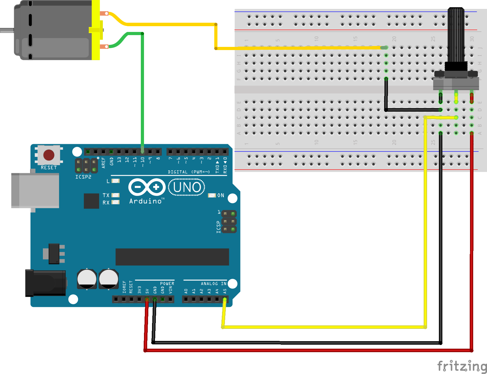
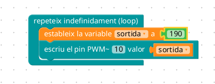
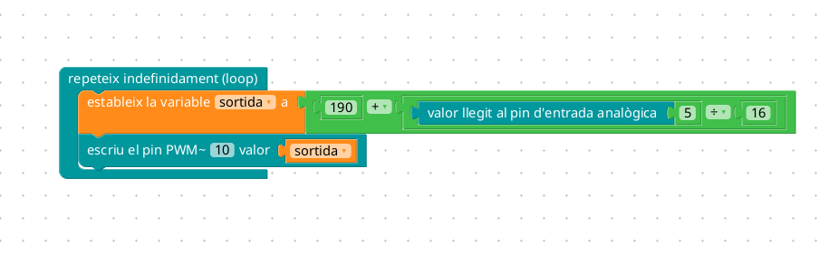
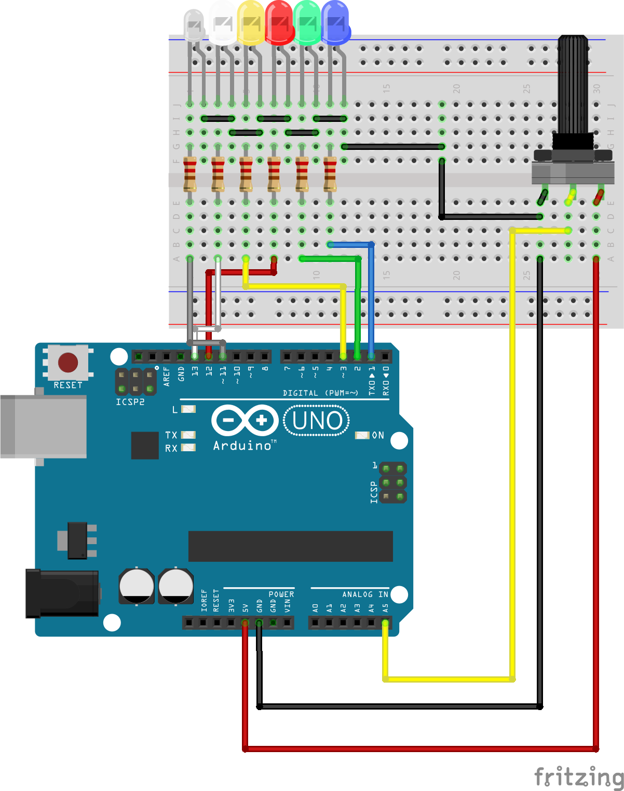

---
title: "INTRODUCCIÓ A BLOCKLY@RDUINO"
author: [Alfredo Rafael Vicente Boix]
date: "2023-06-22"
subject: "Proxmox"
keywords: [Xarxa, Instal·lació]
subtitle: "Plugin per a Arduino IDE"
lang: "ca"
page-background: "background10.pdf"
titlepage: true,
titlepage-rule-color: "360049"
titlepage-background: "background10.pdf"
colorlinks: true
header-includes:
- |
  ```{=latex}
  \usepackage{awesomebox}
  ```
pandoc-latex-environment:
  noteblock: [note]
  tipblock: [tip]
  warningblock: [warning]
  cautionblock: [caution]
  importantblock: [important]
...

<!-- \awesomebox[violet]{2pt}{\faRocket}{violet}{Lorem ipsum…} -->

<!--  -->

# Introducció

En aquesta unitat parlarem del plugin que existeix per a Arduino IDE que ens permet programar en Blocs. Aquest plugin el que fa es traduir els blocs a codi C++ per tant hem d'utilitzar l'Arduino IDE de manera paralela. Blockly@rduino és sistema que ens permetrà fer més coses, però és un poc més complicat.

Uns dels problemes que presenta aquest plugin és que és relativament nou i encara no existeix una versió definitiva, sinó que podem dir que encara està en proves i això fa que siga bastant inestable i apareguen errors de tant que cal solucionar posant-te al codi. És per això que, si bé és interessant coneixer-lo, no es recomana per a treballar en un projecte a no ser que es teste bé el que es va a fer.

# La finestra principal

Quan iniciem en plugin ens apareixerà la següent finestra. Abans de començar és important configurar tots els apartats del plugin. Es bastant farragós però cada vegada que entres has de configurar el teu espai de treball tal i com el vullgues tenir: l'idioma, blocs, etc...



Podem veure que hi han diferents seccions, cada secció té una sèrie de blocs. Els mes importants podem que dir que són:

* Lògica: Agrupa tots els blocs d'operacions lògiques. Cal destacar el condicional si.
* Matemàtiques: Cal destacar les operacions matemàtiques bàsiques.
* Variables: Quan fem clic en crea una variable ens apareixeran tots els blocs necessaris per a operar en la variable.
* Arduino: Aquí destaquem l'element bucle, tot i que existeix una secció a banda. És per a fer coses un poc més avançades.



El primer que farem serà configurar l'idioma i afegirem els blocs Arduino:

{ width=50% }

I després configurarem els blocs que anem a  utilitzar, en el nostre cas agafarem els que anema a utilitzar, afegirem els blocs Aduino

{ width=50% }

## Lògica

És important veure que alguns blocs disposen d'un botó blau que al fer clic ens apareixerà un diàleg on podem ajuntar blocs per a afegir funcionalitats al bloc. El cas més clar és quan volem posar un *sino* al bloc *si*.



# Un polsador. Entrada digital i sortida digital

El primer exemple que anem a veure es tracta d'un polsador que encendrà el LED de la placa Arduino (El pin 13).

## Placa protoboard

Es tracta d'un circuit molt senzill. Hem de tenir en compte que quan polsem es posarà el pin a 5V (al nostre bloc *activat*). Si ens fixem en el circuit hem de veure que hem afegit una resistència entre la entrada del polsador i *GND*. 

::note
Quan utilitzeu LEDs, us recomane utilitzar resistències de 470 Ω. Es un valor bastant estàndard.
:::


## Programa

El programa consistirà en un bucle on si l'entrada al PIN 2 és certa activarà el LED i sinó és certa el desactivarà. Al pin 2 hem connectat el polsador


# Sortides analògiques i entrades analògiques.

En aquest circuit veurem com funcionen les entrades analògiques i les sortides analògiques. Les entrades analògiques ens permetran connectar sensors i les sortides analògiques ens permetran mesurar la intensitat del dispositiu que tinguem connectats a la sortida.

:::warning
A les sortides analògiques no es poden connectar motors, si volem connectar un motor hem de fer ús dels pins *PWM* (els marcats amb ~) i configurar-ho adientment.
:::

## Placa protoboard

Al circuit podem veure com tenim un potenciòmetre connectat a la entrada analògica i un LED que el connectem a una sortida analògica. 


## Programa

El programa simplement llegirà valor a l'entrada analògica i el posarà a la sortida analògica i veurem com la llum va encenent-se poc a poc. El programa com podem veure és molt senzill.


# Motor

Al següent circuit connectarem un motor de baixa potència directament a un pin de la placa Arduino per a controlar la seua velocitat a través d'un potenciòmetre.

:::warning
Aquesta connexió no és la més recomanable. I es recomana sempre fer-ho a través d'un transistor per a controlar i una font d'alimentació externa per al motor, ja que Arduino no és capaç de proporcionar molta intensitat. En aquest exemple el motor funcionarà.
:::

## Placa protoboard

Al circuit connectarem el potenciòmetre a la placa protoboard i el motor a uns dels pins PWD d'Arduino.



## Programa

Abans de realitzar el programa cal veure a partir de quina senyal de pwm el motor es posarà en funcionament. És per això que utilitzem el següent circuit i anem modificant el valor 190 per a traure el valor a partir del qual el motor funciona. En aquest cas 190 comença a funcionar a partir de 190.

:::tip
EL valor PWM ha d'estar entre 0 i 255.
:::



Per tant els valors que hem d'escriure al PIN  de sortida han d'estar entre 190-255 aproximadament. Per a fer això farem que el valor que es llig de la entrada analògica i el dividirem entre 16. Perquè entre 16? Pq entre 190 i 255 van 65 pasos, d'aquesta manera convertim el valor de 0 a 1023 en 0 a 65 aproximadament. A aquest valor li sumem 190 (o 180 si volem que al valor mínim estiga parat), i el valor resultant sempre estarà entre 190 i 255.

Una vegada carregat el projecte veurem que el motor canvia de velocitat.

:::tip
El valor de la entrada analògica va de 0 a 1023.
:::



# Els *shields*. Exemple de shield de DFRobot

Uns dels gran avantatges que presenta Blocky@rduino és que ja té blocs que permete configurar *shields*. El *shileds o escuts* són plaques que ja porten integrats tots els elements necessaris per a fer funcionar un projecte de manera que es munta damunt de la placa Arduino i no cal fer cap circuit.

En aquest cas anem a utilitzar el shield de DFRobot que podem trobar en algunes plataformes xineses per uns 4 €, cosa que ens permet fer projectes senzillets sense massa complicacions.

El projecte que platejarem d'exemple serà amb el shield, on veurem escrit quina llum de diferent color tenim encesa depenent del botó que polsem. Si activem el potenciòmetre ens donarà el valor que està llegint i modificarà el valor d'un LED.

## Placa protoboard

Anem a veure en primer lloc com és el nostre shield. Vegem que podem utilitzar algunes connexions d'Arduino. Les altres són les utilitzades per el shield per a funcionar.

{ width=50% }

El circuit que anem a utilitzar seria el següent, pero has de tenir en compre que es farien a través del shield:



:::note
Al CEFIRE disposem de 3 shields per si algú vol fer ús d'ells per a provar circuits. Els shields es queden al CEFIRE i no es poden prestar.
:::

## Programa

En el programa anem a fer ús dels procediments. Els procediments són parts de codi que es repetixen moltes vegades. D'aquesta manera evitem tindre que escriure codi varies vegades seguides. Tambés existeixen les **funcions**, la diferència és que les funcions tornen un valor i els procediments no.

Quan definim un procediment podem obrir les característiques del procediment i afegir els valors que demana. En aquest cas posarem que volem un valor enter (int) i un valor Text (String).


El aquest cas en el procediment anem a fet el següent:

1. En primer lloc esborrem la pantalla.
2. Després escrivim en la línia 1, en la primera casella el text que hem enviat.
3. Finalment activem un PIN de sortida donat per x.

Una vegada tenim el procediment definit podem utilitzar-lo nombroses vegades dins del nostre programa. Així podem definir que cada vegada que es polse un botó realitze el procediment però canviant els valors que anem a processar.

:::important
Cal tenir en compte que les variables que tenim dins de la funció poden donar problemes i, en alguns casos caldrà inicialitzar-les tal i com hem fet en aquest programa
:::


Finalment si volguerem afegir una característica més al programa podríem afegir un altre procediment on es llegira una entrada analògica i escrivira sobre un PIN de sortida analògica per a augmentar o disminuir la intensitat del LED.


Com podem veure en el programa caldria canviar del programa principal les següents part del codi:

* No podriem utilitzar la sortida 13 que ens queda lliure perquè aquesta sortida no és analògica, podriem canviar-la per la 11.
* Recordem que a la sortida analògica podem posar valors de 0-255, en canvi l'entrada llig valors de 0-1023, per a fer la conversió dividim per 4.1. 
* Hem creat una variable que es diu *valorvell* per a que esborre el programa sempre que hi haja un canvi a l'entrada analògica. O siga al potenciòmetre. Aquest calor el convertim a int per a que no agafe decimals. Açò ho fem ja que el valor de la entrada varia i no dona mai un valor exacte.

La part marcada aniria al final del l'anterior programa.

:::note
Tal i com havíem comentat hi ha blocs que encara no estan del tot traduïts ja que no es tracta d'una versió definitiva.
:::

