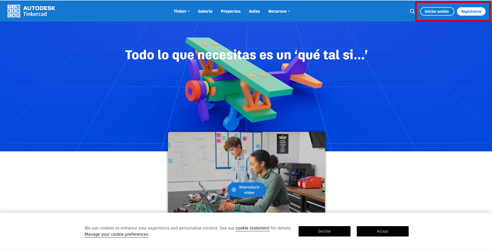
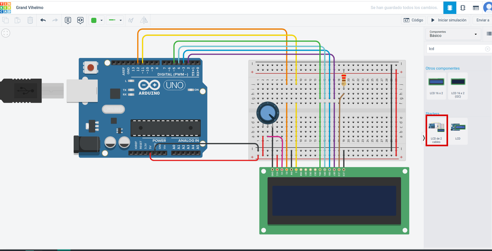
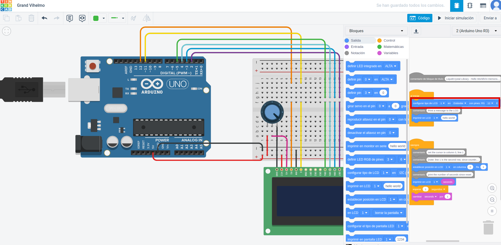
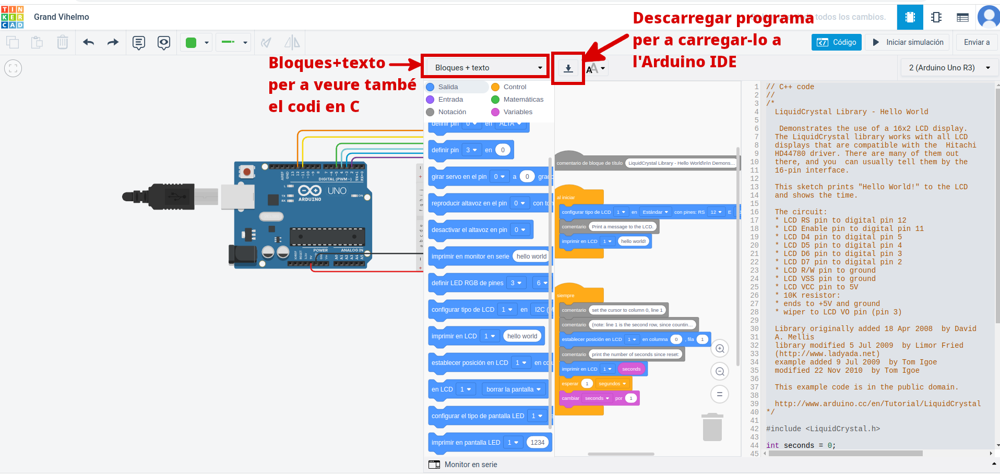

---
title: "INTRODUCCIÓ A TINKERCAD"
author: [Alfredo Rafael Vicente Boix]
date: "2023-06-22"
subject: "Proxmox"
keywords: [Xarxa, Instal·lació]
subtitle: "Simulador d'Arduino"
lang: "ca"
page-background: "background10.pdf"
titlepage: true,
titlepage-rule-color: "360049"
titlepage-background: "background10.pdf"
colorlinks: true
header-includes:
- |
  ```{=latex}
  \usepackage{awesomebox}
  ```
pandoc-latex-environment:
  noteblock: [note]
  tipblock: [tip]
  warningblock: [warning]
  cautionblock: [caution]
  importantblock: [important]
...

<!-- \awesomebox[violet]{2pt}{\faRocket}{violet}{Lorem ipsum…} -->

<!-- { width=50% } -->

# Introducció
 
Per últim veurem una ferramenta que pot resultar molt útil per a compartir els nostres projectes i el que és més important ens permetrà simular el seu funcionament sense necessitat de fer cap circuit.

El TinkerCAD és una ferramenta **que no està pensada** expressament per a Arduino sinó que ens permet crear diferents tipus de projectes, a més, ens permet compartir projectes i crear cursos per a que els alumnes puguen accedir a "classes". Aquest apartat no el veurem en aquesta unitat ja que no forma part dels propòsits del curs, però és bastant intuitiu i ho podreu resoldre fàcilment.

Uns del desavantatges que presenta aquesta ferramenta és que no podrem carregar els nostres projectes externs per a fer simulacions, sempre tindrem que crear el projecte ací, i en tot cas descarrega el codi per a carregar-lo després en Arduino IDE.

La companyia que està darrere d'aquesta pàgina és Autodesk, per tant no és codi lliure i hem de ser conscients que aquesta companyia tindrà accés a les dades que nosaltres posem en la plataforma.

:::warning
Si aneu a crear una classe, recordeu que no està permès que poseu les dades dels vostres alumnes en cap lloc que no siguen els servidors autoritzats per Conselleria, per tant, si voleu crear una classe us recomanem que utilitzeu pseudònims.
:::

# TinkerCAD

Podem anar a la pàgina de TinkerCAD [ací](https://www.tinkercad.com/) (https://www.tinkercad.com/). Una vegada estiguem dins veurem el següent.

{ width=50% }

Anirem a Inici o a registrar-nos. Els procés de registre és com qualsevol altre. En el nostre cas estem donats d'alta com a educadors i la pàgina que ens apareix és la següent:

{ width=50% }

Una vegada fem clic ens pareixerà la següent pàgina. Ací ja podem començar a simular el nostre circuit. 

{ width=50% }

Ara podem fer clic als diferents dispositius i desplaçar-los a l'espai de treball. En aquest cas seleccionem la placa Arduini que per defecte ens apareixerà el circuit de *Blink*, que fa parpellejar un LED.

{ width=50% }

Ara agafarem els següents elements. Esborrem la placa Arduino is seleccionem:

* Placa de proves: que ja duu l'Arduino amb una placa de proves incorporada.
* Resistència
* LED

El circuit ens quedaría de la següent manera:

{ width=50% }

Ara si fem clic sobre *código* podrem veure el codi i si fem clic a *Iniciar simulación* podrem veure com el LED s'encén i s'apaga. Com podem veure la secció dels blocs és bastant limitada i no disposa de tants blocs com poden ser S4A o Blockly@rduino, per tant ens limitarà la complexitat del projecte que podem fer.

{ width=50% }

Si comencem la simulació podrem veure com s'encén el LED de la placa i de la placa de proves.

:::note
Recordem que el LED de la placa proves està connectat a la sortida 13. Aquest s'utilitza en molts casos per a fer proves.
:::

{ width=50% }

# Projecte. El rellotge

Anem a proposar com a xicotet exemple fer el rellotge utilitzant el circuit de LCD amb dos cables. 

:::note
També es pot utilitzar el projecte de LCD, que vegem que té connectats els pins SCL i SDA, això simplifica bastant les connexions i ens dona més entrades i sortides lliures. Però en el nostre cas, en realitat ara ens dona igual.
:::

{ width=50% }

Podem veure que ja porta carregat un programa per a veure com apareix en la pantalla. Podem crear el nostre programa a partir d'aquest ja que la inicialització del LCD és la mateixa.

:::note
Sempre cal inicialitzar el LCD definint quin protocol anem a utilitzar, connexió en paral·lel o I2C. Cal tenir en compte que per a fer funcionar un LCD amb el protocol cal un *driver* que s'acopla al LCD.
:::

{ width=50% }

A mesura que anem creant el codi podem veure la traducció que està fent a C, i si volem fer el projecte en un circuit real podrem descarregar-nos l'arxiu per a obrir-lo en l'Arduino IDE i muntar-lo.

{ width=50% }

Tin en compte que pots ampliar la secció de codi per a poder programar d'una manera més còmoda.

{ width=50% }

En la següent imatge podem veure el codi que hem creat. Es tracta d'un bucle que es va repetint continuament i va afegint esperant-se 1 segon cada vegada per anar incrementant una variable anomenada segons.

:::warning
Aquest projecte està fet amb propòsits didàctics, ja que hi hauria un retràs en el temps que tarda en executar el codi després d'esperar 1 segon. Per a fer-ho correctament caldria utilitzar interrupcions, però la programació en blocs això no ho permet.
:::

Posteriorment comprovem que el valor de segons no és 60, i si és 60 increment minuts en 1 i tornem segons a 0. Això ho repetim per a minuts i per a hores però en 24.

En el següent bloc escrivim en pantalla els segons, minuts i hores separats per : i afegim un 0 si el valor de les variables està entre 0 i 9.

{ width=50% }

Ací podem veure la nostra simulació:

{ width=50% }