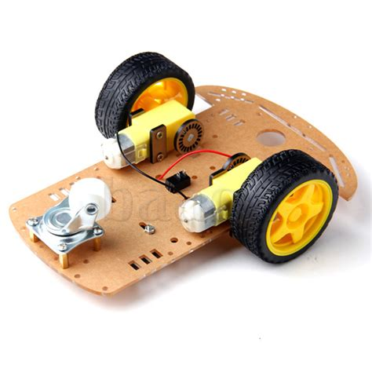
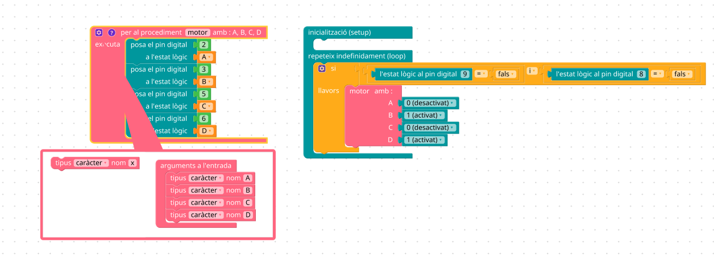
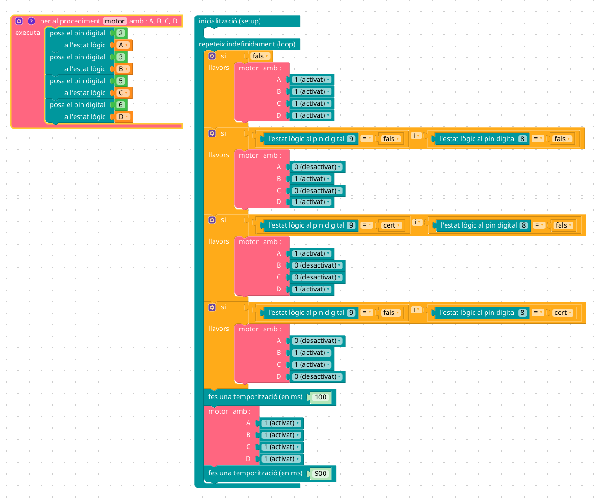

---
title: "SEGUIDOR DE LÍNIA"
author: [Alfredo Rafael Vicente Boix]
date: "2023-06-22"
subject: "Proxmox"
keywords: [Xarxa, Instal·lació]
subtitle: "Projecte d'Arduino"
lang: "ca"
page-background: "background10.pdf"
titlepage: true,
titlepage-rule-color: "360049"
titlepage-background: "background10.pdf"
colorlinks: true
header-includes:
- |
  ```{=latex}
  \usepackage{awesomebox}
  ```
pandoc-latex-environment:
  noteblock: [note]
  tipblock: [tip]
  warningblock: [warning]
  cautionblock: [caution]
  importantblock: [important]
...

<!-- \awesomebox[violet]{2pt}{\faRocket}{violet}{Lorem ipsum…} -->

<!-- { width=50% } -->

# Introducció
 
En aquest últim bloc anem a tractar de fer un projecte. En aquest bloc tractarem d'anar fent un projecte pas per pas. Això no significa que heu de seguir vosaltres el projecte, de fet, ja vo avancem que nos e vos va a demanar realitzat cap projecte físic per a finalitzar el curs. Sinó plantejar la realització d'un projecte per a realitzar amb els alumnes. Disposeu de la placa sensor kit per a fer proves amb els sensors.

El projecte en qüestió no es realitza en un dia o en dos. El projecte que vos plantegem açí, es realitza normalment a 2n de la ESO muntant-lo des de 0 i comporta un trimestre amb els alumnes. S'ha realitzat els mateix projectes a 1r de la ESO, però facilitant-los l'estructura i el cablejat de l'integrat que anem a utilitzar. Però en en aquest curs ens centrem només en la part tècnica... Que sapiguem fer-ho nosaltres.

Quan ens plategem fer un projecte amb Arduino a la classe, abans hem de  dissenyar-lo nosaltres, és una tasca que porta moltes hores i molts dies de prova i error fins que finalment funciona tot. Es poden buscar en multitud de pàgines projectes ja realitzats per i simplement adaptar-los a les nostres necessitats. En qualsevol cas, sempre hi haurà moments de desesperació i moments en que podeu tirar avant.

## El seguidor de línia

Aquest projecte es bastant característic dels projectes que es realitzen a secundària, però aquest és fàcilment adaptable per a primària. Tot dependrà sempre de què volem que realitzen els alumnes. Des de programar directament amn C, o amb blocs i quines parts del codi volem que realitzen. Nosaltres no anem a plantejar cap adreçament, sinó que plantejarem de manera genèrica quin és el procediment que moltes vegades seguim a l'hora de realitzar un projecte.

El projecte en qüestió consisteix en realitzar un robot que automàticament vaja seguint una línia i vaja corregint el seu error cada vegada que es desvie un poc del seu recorregut. Es tracta d'una idea senzilla però que té una implementació relativament complexa.

El primer que hem de plantejar-nos és quins són els elements que anem a necessitar, en el nostre cas ens caldria un sensor que detectés la diferència entre llum fosca i llum clara i que puguem ajustar-lo, en aquest cas optarem per un sensor ir on es pot ajustar la sensibilitat del mateix i té un preu reduït (0,6 € aprox.). 

{ width=50% }

Altre dels elements que ens caldrien serien els motors, en aquest cas i per a tot tipus de vehicles senzills, és millor es comptar amb dos motors (un per a cada roda tractora), podem controlar el vehicle amb aquest dos motors en funció de quin està funcionant (anant avant o enrere).

:::note
En funció de la dificultat es pot afegir més o menys circuiteria. Per a cursos més avançats es pot dissenyar un pont un H per a controlar els motors amb transistors. En el nostre cas farem ús d'un integrat.
:::

## Els nostres aliats: els integrats

Quan parlem d'integrats molt sovint ens ve al cap coses molt complexes que la nostra ment no es capaç de desxifrar (bé, així ho percebia jo), però res més lluny de la realitat, els integrats ens van a facilitar la nostra tasca, això sí, cal coneixer-los.

En el nostre cas anem a utilitzar un integrat anomenat L293D, el qual té nombroses variants, però aquesta és la més senzilla. Concretament en aquest tipus de projecte podem utilitzar mòduls preparats per a Arduino que ha venen preparats per a connectar els motors i 4 entrades:

{ width=50% }

Com podem veure connectem un motor a A+ i A-, l'altre a B+ i B-, i les 4 entrades IN ens serviran per a controlar els motors. Bàsicament IN1 i IN2 controla un motor i IN3 i IN4 l'altre segons la següent taula:

|IN1|IN2|Resultat|
|---|---|--------|
|LOW|LOW|Aturat|
|LOW|HIGH|Gira dreta|
|HIGH|LOW|Gira esquerre|
|LOW|LOW|Aturat|

Òbviament l'altre motor funciona igual però amb IN3 i IN4. I d'aquesta manera ja ens hem estalviat gran part de la circuiteria que hem de realitzar. 

Existeixen integrats gairebé per a qualsevol cosa, i es recomana treballar amb ells ja que simplifiquen molt els dissenys, això sí cal que els docents vagen tenint coneixements sobre quins tipus d'integrats poden utilitzar i això sí que cal els professors es vagen formant poc a poc.

## Base estructural

En aquest curs no pretenem explicar com realitzar una base estructural per al nostre projecte ja que només tractem de donar les primeres pinzellades per a començar a treballar amb Arduino, tot i això, en aquest projecte concretament hem utilitzat una base comercial que podeu trobar [ací](https://www.tecnofilo.es/motores/202-chasis-robot-smart-car-2wd-coche-2-ruedas.html), [ací](https://leantec.es/tienda/chasis-robot-2wd-chasis-robot-de-2-ruedas/), [ací](https://robotlandia.es/chasis/623-chasis-2wd-de-coche-inteligente-arduino-diy-smart-car-robot-kit-de-dos-ruedas-con-codificador-de-velocidad-.html), [ací](https://es.aliexpress.com/item/1005001651643237.html?spm=a2g0o.productlist.main.1.49d715e9kWI7VX&algo_pvid=4804e4da-d90b-4667-bf68-81164d9b6182&algo_exp_id=4804e4da-d90b-4667-bf68-81164d9b6182-0&pdp_npi=3%40dis%21EUR%217.62%217.23%21%21%21%21%21%402100b0d116872822935123633d0742%2112000025516098421%21sea%21ES%21116076280&curPageLogUid=oN94OQo53Pzr) i com no [ací](https://www.amazon.es/UMTMedia%C2%AE-Chasis-inteligente-Arduino-Raspberry/dp/B096XZ9VK2/ref=sr_1_4?keywords=chasis+robot+2wd&qid=1687282238&sr=8-4). Així com en nombrosos llocs comercials.

:::note
En el nostre cas la despesa realitzada és d'uns 10€, i ja tenim la base per a crear nombrosos projectes. Des del nostre punt de vista és preferible treballar amb aquest tipus d'estructures ja que són econòmiques i no són una gran pèrdua si es perden o es trenquen.
:::

La base en qüestió s'anomena chasis 2WD i ve amb nombrosos forats per a afegir els elements que nosaltres considerem oportuns per a realitzar els nostres projectes. Sempre existeix l'opció en funció de la duració i dificultat del projecte de realitzat al taller la nostra base de manera manual.

{ width=50% }

# Circuit

Ja tenim la nostra base i els possibles elements que anem a utilitzar, en aquest cas igualment hem de plantejat quina és la dificultat que volem plantejar a l'alumnat ja que podem dissenyar nosaltres el projecte o podem deixar que ells plategen les possibles solucions i les exposen, de manera que entre tots vagen veient quines són les possibles dificultats i les solucions que entre tots van plantejant.

:::note
El control es pot fer amb un circuit electrònic sense necessitat d'Arduino, eixa seria la solució òptima. Però no és el plantejament d'aquest curs.
:::

En el nostre cas anem a utilitzat Arduino per a fer tot el control. De manera que una possible solució al circuit seria la següent:

<!-- IMATGE CIRCUIT -->
{ width=50% }

Com es pot veure, nosaltres no hem fet ús del mòdul sino directament de l'integrat L293D, les connexions són sempre les mateixes, sempre es seguix el mateix esquema de muntatge, excepte les estrades a la placa Arduino que cadascú escollix les que vol.

# Muntatge 

Una vegada hem realitzat el muntatge podem veure una cosa com esta. Aquest muntatge s'ha de plantejar de manera gradual i anar entenent cadascun dels elements un a un. La part de l'integrat recomanen donar-la ja feta o utilitzar un mòdul ja muntat. En aquest cas hem utilitzat un integrat ja que no disposem d'un mòdul.

Realitzar el cablejat pot resultar complexe i la més propensa a errors, per això s'ha de realitzar poc a poc. Hi han diferents estratègies per a que no hi haja errors a l'hora de realitzar el muntatge i és donar el cablejat del mateix color que tenen al circuit, així com la quantitat justa. Si els falta algun color és que algun l'han posat on no tocava i si els faltes cables també podem intuir que hi ha un error.

El muntatge del projecte quedaria uan cosa com esta.

<!-- IMATGE muntatge -->
{ width=50% }

Cal tenir en compte que el muntatge que realitzeu en un principi moltes vegades haurà d'ajustar-se bé perquè no gira bé o hi ha alguna cosa que no està ajustada, ja vos hem dit que estem muntant un prototip i aquesta part correspon al professorat. En el nostre cas una de les parts que hem d'ajustar és el sensor IR. Aquest té un potenciòmetre que podem anar ajustant en funció de la nostra línia negra. A més hem hagut de posar un tub (la part de dintre està pintada en negre) ja que la llum ambiental pot afectar a la sensibilitat del sensor.

<!-- IMATGE SENSOR AMB POTENCIÒMETRE -->
{ width=50% }

Aquí teniu un exemple de com l'hem muntat:

{ width=50% }

# Programa

En aquest projecte hem decidit utilitzar Blockly@rduino ja que ens simplifica molt el muntatge. Realitzar el programa sencer des del principi fins al final és una tasca que gairebé no realitza ningú. Quan plategem un prototip hem d'anar mirant cadascuna de les parts del que consta el nostre prototip. En el nostre cas hem anat provant les següents parts:

1. Provar que s'encen el LED de la placa quan detecte presència en el sensor.


<!-- programa 1 -->

2. Provar 2 eixides per a fer funcionar el motor en un sentit o en altre.


<!-- progrma 2 -->


Fixem-nos que en aquest circuit hem creat una funció per a simplificar el funcionament. Aquesta funció rep 4 entrades que és el que volem escriure al controlador del motor. Podem resumir el funcionament en aquesta taula:

| Sensor 9 | Sensor 8 | A | B | C | D | Resultat | 
| -- | -- | --- | --- | --- | --- | --------------- |
| fals | fals | desactivat | activat | desactivat | activat | Els dos motors van avant |
| cert | fals | activat | desactivat | desactivat | activat | Un motor va avant i l'altre enrere, per tant gira |
| fals | cert | desactivat | activat | activat | desactivat | Un motor va avant i l'altre enrere, per tant gira |
| cert | cert | activat | activat | activat | activat | Detecta que està en 2 linies negres i es para |

El sensor al pin 9 i al pin 8 detecten la presència de la línia negra o no i en funció de la detecció gira cap a un costat o l'altre. Podem anar provant totes les opcions per a assegurar-nos que els motors funcionen com cal.


Finalment, ho posaríem tot junt. En funció de la entrada de cada sensor tindriem una sortida. El que hem fet bàsicament és repetir la mateixa condició per a cada estat.

<!-- programa -->


Fixem-nos que no tenim la condició de cert / cert per als sensors. Això és degut a que estem fent funcionar el motors durant 100 ms i parant-los 900 ms, si no es dona cap condició anterior, per defecte estarà parat, per tant no ens cal la condició cert / cert per als sensors.

El motiu per el qual ho fem així és per a que el cotxe vaja més lentament, podem anar jugant en aquests valors, el problema és que si va massa ràpid és possible que no es puga fer el gir del vehicle i es passe la línia negra. És una cosa amb la qual hi ha que anar jugant.

:::warning
Per als usuaris més avançats cal dir que el L293D està preparat per a suportar PWM, però en aquest motors no funciona. Són massa poc potents. El PWM és un pin d'Arduino que ens permet controlar la velocitat del motor. Però els motors que solem utilitzat solen ser massa poc potents.
:::